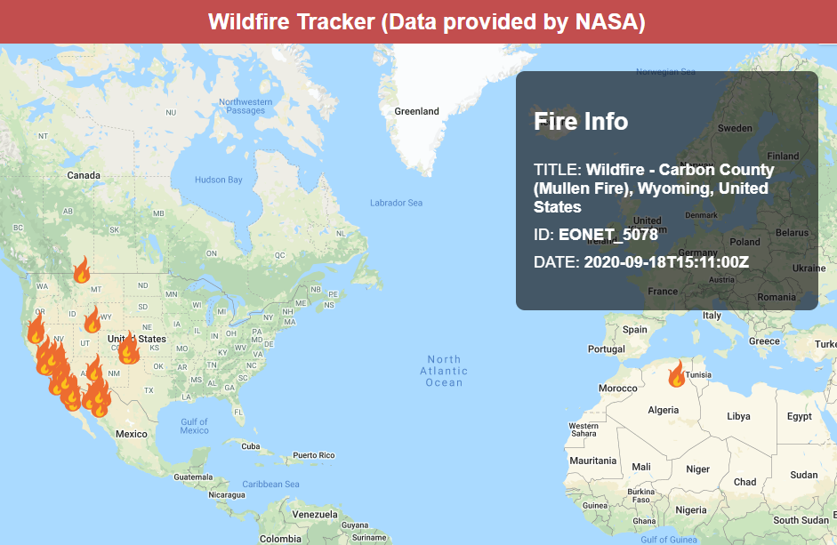

# Wildfire Tracker

> This is a React map to track recent wildfires.
Live site: http://jpotterf.github.io/wildfire-tracker

## Data
NASA API Documentation: https://api.nasa.gov. 
NASA API Data: https://eonet.sci.gsfc.nasa.gov/api/v2.1/events. 

